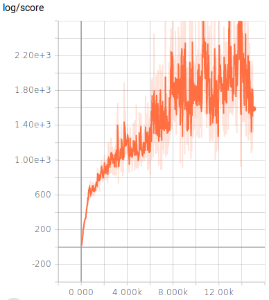
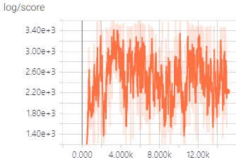
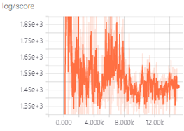
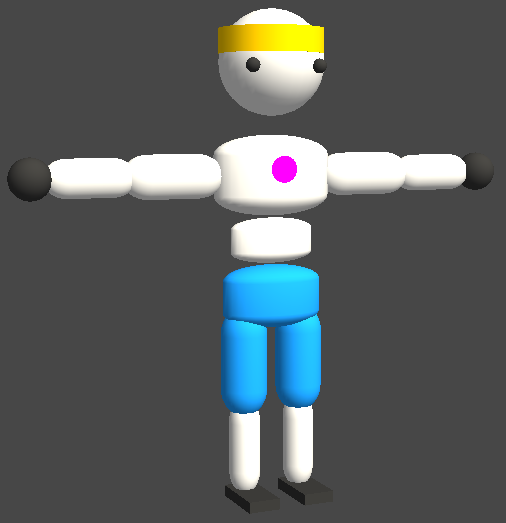
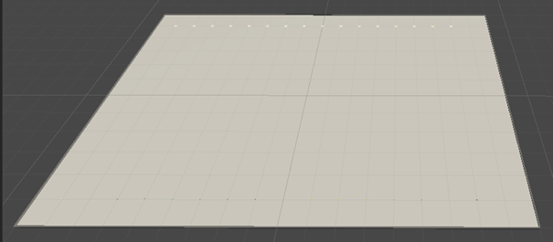
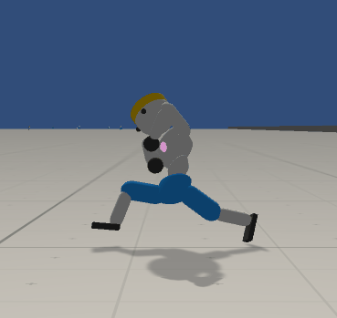
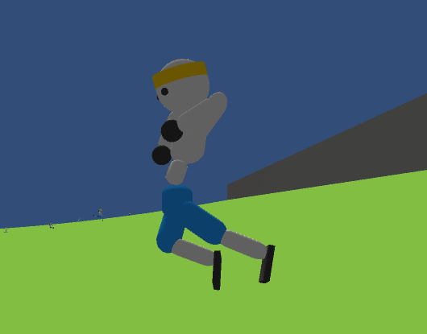

# Policy Gradient (PG) Algorithms

This repository contains PyTorch (v0.4.0) implementations of typical policy gradient (PG) algorithms.
* Vanilla Policy Gradient [[1](#1)]
* Truncated Natural Policy Gradient [[4](#4)]
* Trust Region Policy Optimization [[5](#5)]
* Proximal Policy Optimization [[7](#7)].

We have implemented and trained the agents with the PG algorithms using the following benchmarks. Trained agents and Unity ml-agent environment source files will soon be available in our repo!
* mujoco-py: [https://github.com/openai/mujoco-py](https://github.com/openai/mujoco-py)
* Unity ml-agent: [https://github.com/Unity-Technologies/ml-agents](https://github.com/Unity-Technologies/ml-agents)

For reference, solid reviews of below papers related to PG (in Korean) are located in https://reinforcement-learning-kr.github.io/2018/06/29/0_pg-travel-guide/. Enjoy!

* [1] R. Sutton, et al., "Policy Gradient Methods for Reinforcement Learning with Function Approximation", NIPS 2000.

* [2] D. Silver, et al., "Deterministic Policy Gradient Algorithms", ICML 2014.

* [3] T. Lillicrap, et al., "Continuous Control with Deep Reinforcement Learning", ICLR 2016.

* [4] S. Kakade, "A Natural Policy Gradient", NIPS 2002.

* [5] J. Schulman, et al., "Trust Region Policy Optimization", ICML 2015.

* [6] J. Schulman, et al., "High-Dimensional Continuous Control using Generalized Advantage Estimation", ICLR 2016.

* [7] J. Schulman, et al., "Proximal Policy Optimization Algorithms", arXiv, https://arxiv.org/pdf/1707.06347.pdf.

Table of Contents
<!-- @import "[TOC]" {cmd="toc" depthFrom=1 depthTo=6 orderedList=false} -->
<!-- code_chunk_output -->

* [Policy Gradient (PG) Algorithms](#policy-gradient-pg-algorithms)
	* [Mujoco-py](#mujoco-py)
		* [1. Installation](#1-installation)
		* [2. Train](#2-train)
			* [Basic Usage](#basic-usage)
			* [Continue training from the saved checkpoint](#continue-training-from-the-saved-checkpoint)
			* [Test the pretrained model](#test-the-pretrained-model)
			* [Modify the hyperparameters](#modify-the-hyperparameters)
		* [3. Tensorboard](#3-tensorboard)
		* [4. Trained Agent](#4-trained-agent)
	* [Unity ml-agents](#unity-ml-agents)
		* [1. Installation](#1-installation-1)
		* [2. Environments](#2-environments)
		* [3. Train](#3-train)
			* [Basic Usage](#basic-usage-1)
			* [Continue training from the saved checkpoint](#continue-training-from-the-saved-checkpoint-1)
			* [Test the pretrained model](#test-the-pretrained-model-1)
			* [Modify the hyperparameters](#modify-the-hyperparameters-1)
		* [4. Tensorboard](#4-tensorboard)
		* [5. Trained Agent](#5-trained-agent)
	* [Reference](#reference)

<!-- /code_chunk_output -->

## Mujoco-py
### 1. Installation

* [Ubuntu](https://github.com/reinforcement-learning-kr/pg_travel/wiki/Installing-Mujoco-py-on-Linux)

### 2. Train

Navigate to `pg_travel/mujoco` folder

#### Basic Usage

Train the agent with `PPO` using `Hopper-v2` without rendering.
~~~
python main.py
~~~
* Note that models are saved in `save_model` folder automatically for every 100th iteration.

Train the agent with `TRPO` using `HalfCheetah` with rendering
~~~
python main.py --algorithm TRPO --env HalfCheetah-v2 --render
~~~
* **algorithm**: PG, TNPG, TRPO, **PPO**(default)
* **env**: Ant-v2, HalfCheetah-v2, **Hopper-v2**(default), Humanoid-v2, HumanoidStandup-v2, InvertedPendulum-v2, Reacher-v2, Swimmer-v2, Walker2d-v2

#### Continue training from the saved checkpoint

~~~
python main.py --load_model ckpt_736.pth.tar
~~~
* Note that `ckpt_736.pth.tar` file should be in the `pg_travel/mujoco/save_model` folder.
* Pass the arguments `algorithm` and/or `env` if not `PPO` and/or `Hopper-v2`.

#### Test the pretrained model

Play `5` episodes with the saved model `ckpt_738.pth.tar`
~~~
python test_algo.py --load_model ckpt_736.pth.tar --iter 5
~~~
* Note that `ckpt_736.pth.tar` file should be in the `pg_travel/mujoco/save_model` folder.
* Pass the arguments `env` if not `Hopper-v2`.

#### Modify the hyperparameters

Hyperparameters are listed in `hparams.py`.
Change the hyperparameters according to your preference.

### 3. Tensorboard

We have integrated [TensorboardX](https://github.com/lanpa/tensorboardX) to observe training progresses.
* Note that the results of trainings are automatically saved in `logs` folder.
* TensorboardX is the Tensorboard-like visualization tool for Pytorch.

Navigate to the `pg_travel/mujoco` folder
~~~
tensorboard --logdir logs
~~~

### 4. Trained Agent

We have trained the agents with four different PG algortihms using `Hopper-v2` env.

| Algorithm | Score | GIF |
|:---:|:---:|:---:|
| Vanilla PG |  |  |
| NPG |  |  |
| TRPO |  |  |
| PPO |  |  |

## Unity ml-agents
### 1. Installation

* [Ubuntu](https://github.com/reinforcement-learning-kr/pg_travel/wiki/Installing-Unity-ml-agents-on-Linux)
* [Windows](https://github.com/reinforcement-learning-kr/pg_travel/wiki/Installing-Unity-ml-agents-on-Windows)

### 2. Environments

We have modified `Walker` environment provided by [Unity ml-agents](https://github.com/Unity-Technologies/ml-agents/blob/master/docs/Learning-Environment-Examples.md#walker).

| Overview | image |
|:---:|:---:|
| Walker |  |
| Plane Env |  |
| Curved Env |  |

Description
* 212 continuous observation spaces
* 39 continuous action spaces
* 16 walker agents in both Plane and Curved envs
* `Reward`
    * +0.03 times body velocity in the goal direction.
    * +0.01 times head y position.
    * +0.01 times body direction alignment with goal direction.
    * -0.01 times head velocity difference from body velocity.
    * +1000 for reaching the target
* `Done`
    * When the body parts other than the right and left foots of the walker agent touch the ground or walls
    * When the walker agent reaches the target

[Prebuilt Unity envrionements](https://drive.google.com/drive/folders/1fpdyOC0cU3RXe9LZ90Ic2yH3686b8PP-)
* Contains Plane and Curved walker environments for Linux / Mac / Windows!
* Linux headless envs are also provided for [faster training](https://github.com/Unity-Technologies/ml-agents/blob/20569f942300dc9279587a17ea3d3a4981f4429b/docs/Learning-Environment-Executable.md) and [server-side training](https://github.com/Unity-Technologies/ml-agents/blob/d37bfb63f9eb7c1651ac07de13627efa6ddfbed6/docs/Training-on-Amazon-Web-Service.md#training-on-ec2-instance).
* Download the corresponding environments, unzip, and put them in the `pg_travel/unity/env` folder.

### 3. Train

Navigate to the `pg_travel/unity` folder

#### Basic Usage

Train walker agent with `PPO` using `Plane` environment without rendering.
~~~
python main.py --train
~~~
* The PPO implementation is for multi-agent training. Collecting experiences from multiple agents and using them for training the global policy and value networks ([brain](https://github.com/Unity-Technologies/ml-agents/blob/master/docs/Learning-Environment-Design-Brains.md)) are included. Refer to `pg_travel/mujoco/agent/ppo_gae.py` for just single-agent training.
* See arguments in main.py. You can change hyper parameters for the ppo algorithm, network architecture, etc.
* Note that models are saved in `save_model` folder automatically for every 100th iteration.

#### Continue training from the saved checkpoint

~~~
python main.py --load_model ckpt_736.pth.tar --train
~~~
* Note that `ckpt_736.pth.tar` file should be in the `pg_travel/unity/save_model` folder.

#### Test the pretrained model

~~~
python main.py --render --load_model ckpt_736.pth.tar
~~~
* Note that `ckpt_736.pth.tar` file should be in the `pg_travel/unity/save_model` folder.

#### Modify the hyperparameters

See `main.py` for default hyperparameter settings.
Pass the hyperparameter arguments according to your preference.

### 4. Tensorboard

We have integrated [TensorboardX](https://github.com/lanpa/tensorboardX) to observe training progresses.

Navigate to the `pg_travel/unity` folder
~~~
tensorboard --logdir logs
~~~

### 5. Trained Agent

We have trained the agents with `PPO` using `plane` and `curved` envs.

| Env | GIF |
|:---:|:---:|
| Plane |  |
| Curved |  |

## Reference
We referenced the codes from below repositories.
* [OpenAI Baseline](https://github.com/openai/baselines/tree/master/baselines/trpo_mpi)
* [Pytorch implemetation of TRPO](https://github.com/ikostrikov/pytorch-trpo)
* [RLCode Actor-Critic](https://github.com/rlcode/reinforcement-learning-kr/tree/master/2-cartpole/2-actor-critic)
